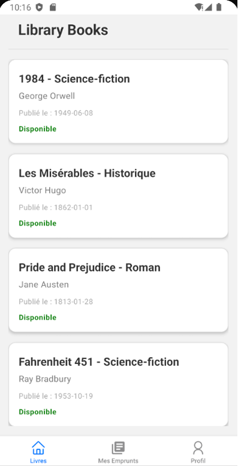
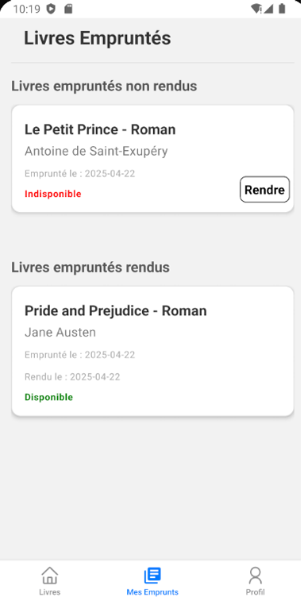
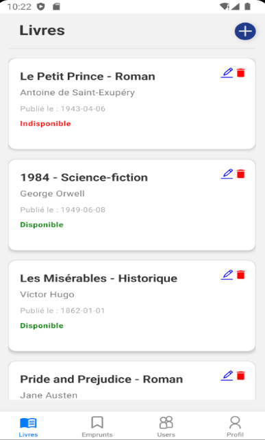
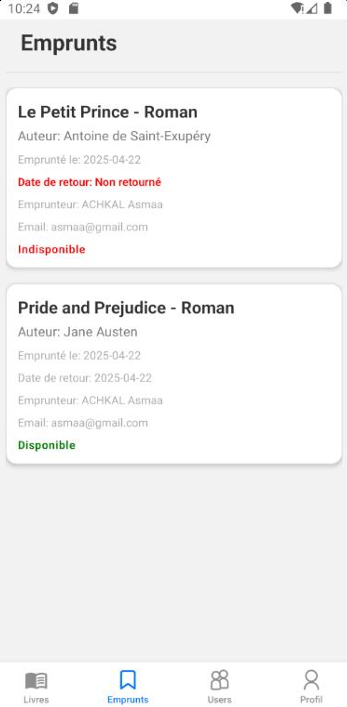

# Library and Borrowing Management Mobile Application

A full-stack mobile application for managing books and borrowing operations.

The solution combines a React Native mobile application with a secure REST API built using Node.js, Express.js and Prisma ORM.

It enables users to browse books, borrow and return them, while administrators can manage books and borrowing records through dedicated management features.

---

## Problem Statement

Many educational institutions, training centers and libraries still rely on manual processes to manage book borrowing operations.

These methods often lead to:

- Lack of automation
- Difficulty tracking borrowed books
- Limited accessibility
- Inefficient resource management

This project provides a centralized and mobile-first solution to simplify and automate library operations.

---

## Objectives

The project aims to:

- Provide secure authentication using JWT
- Allow users to browse available books
- Enable borrowing and returning books
- Automate book availability management
- Manage books through complete CRUD operations
- Improve accessibility through a mobile application

---

## Features

### User Features

- User registration
- Secure authentication with JWT
- View available books
- View detailed book information
- Borrow books
- Return borrowed books
- Borrowing history
- Profile management
- Logout

### Administrator Features

#### Book Management

- Add books
- Edit books
- Delete books
- View all books
- Monitor book availability

#### Borrowing Management

- View all borrowings
- Track returned books
- Track active borrowings

#### Administration

- Administrator profile management
- Secure authentication
- Logout

---

## Database Model

### User

- id
- nom
- prenom
- telephone
- email
- password
- role (USER / ADMIN)

### Livre

- id
- titre
- auteur
- datePublication
- description
- categorie
- isbn
- disponible

### Emprunt

- id
- userId
- livreId
- dateEmprunt
- dateRetour

---

## Technologies Used

### Backend

- Node.js
- Express.js
- Prisma ORM
- JWT Authentication
- MySQL

### Mobile Application

- React Native
- Expo
- Expo Router
- Fetch API
- React Context API

### Development Tools

- Visual Studio Code
- Postman
- Android Studio
- XAMPP

---

## Installation

### Clone the repository

```bash
git clone https://github.com/AsmaaAchkal/library-borrowing-management-mobile-app.git
```

### Backend Setup

```bash
cd backend

npm install

npx prisma generate

npx prisma migrate dev --name init

node seed.js

cd src

node server.js
```

### Mobile Application Setup

```bash
npm install

npx expo start
```

---

## Screenshots

### Authentication


### Available Books



### Book Details and Borrowing


### Borrowing History



### Book Management (Admin)



### Borrowing Management (Admin)



